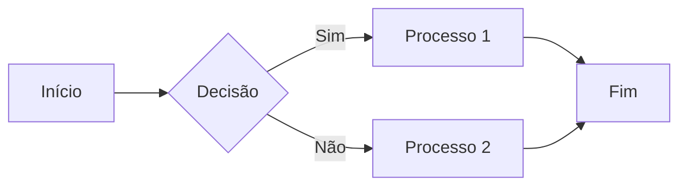
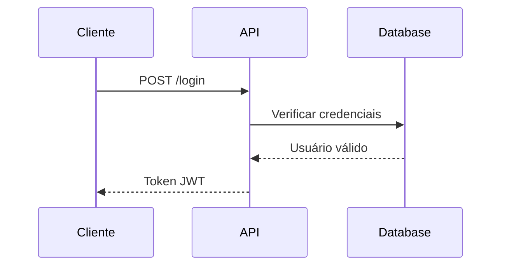
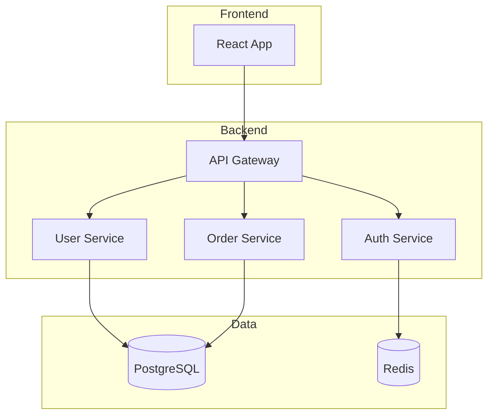

## Formas de adicionar diagramas na documentação

### 1. ASCII Art (Simples e Rápido)

Ideal para diagramas simples diretamente no Markdown:

```
┌──────────────┐     ┌──────────────┐     ┌──────────────┐
│   Frontend   │────▶│   Backend    │────▶│   Database   │
└──────────────┘     └──────────────┘     └──────────────┘
```

**Ferramentas para criar:**

- https://asciiflow.com/ - Desenhe com mouse
- https://textik.com/ - Editor visual

**Exemplo prático - Arquitetura de 3 camadas:**

```
┌─────────────────────────────────────────────────────────┐
│                    Presentation Layer                    │
│  ┌──────────┐  ┌──────────┐  ┌──────────┐              │
│  │   Web    │  │  Mobile  │  │   API    │              │
│  └──────────┘  └──────────┘  └──────────┘              │
└─────────────────────────────────────────────────────────┘
                          │
                          ▼
┌─────────────────────────────────────────────────────────┐
│                    Business Layer                        │
│  ┌──────────┐  ┌──────────┐  ┌──────────┐              │
│  │ Services │  │  Logic   │  │ Validation│              │
│  └──────────┘  └──────────┘  └──────────┘              │
└─────────────────────────────────────────────────────────┘
                          │
                          ▼
┌─────────────────────────────────────────────────────────┐
│                     Data Layer                           │
│  ┌──────────┐  ┌──────────┐  ┌──────────┐              │
│  │   ORM    │  │  Cache   │  │   DB     │              │
│  └──────────┘  └──────────┘  └──────────┘              │
└─────────────────────────────────────────────────────────┘
```

### 2. Imagens (Mais Flexível)

Crie diagramas em ferramentas externas e adicione como imagens.

#### Estrutura de pastas sugerida:

```
website/static/img/
├── diagrams/
│   ├── cloud/
│   │   ├── aws-architecture.png
│   │   └── azure-services.svg
│   ├── architecture/
│   │   ├── microservices.png
│   │   └── event-driven.png
│   └── devops/
│       ├── ci-cd-pipeline.png
│       └── kubernetes-cluster.svg
```

#### Como usar no Markdown:

```markdown

```

**Ferramentas recomendadas:**

| Ferramenta       | Tipo        | Custo    | Link                        |
| ---------------- | ----------- | -------- | --------------------------- |
| **Draw.io**      | Desktop/Web | Gratuito | https://app.diagrams.net/   |
| **Excalidraw**   | Web         | Gratuito | https://excalidraw.com/     |
| **Mermaid Live** | Web         | Gratuito | https://mermaid.live/       |
| **Lucidchart**   | Web         | Freemium | https://www.lucidchart.com/ |
| **PlantUML**     | Código      | Gratuito | https://plantuml.com/       |

### 3. Mermaid (Código → Diagrama)

Mermaid transforma código em diagramas. Ideal para versionamento.

#### Fluxograma



#### Diagrama de Sequência



#### Diagrama de Arquitetura



#### Como habilitar Mermaid no Docusaurus v1

**Passo 1:** Edite `website/siteConfig.js`:

```javascript
const siteConfig = {
  // ... outras configs

  scripts: [
    "https://buttons.github.io/buttons.js",
    "https://cdn.jsdelivr.net/npm/mermaid@10/dist/mermaid.min.js",
  ],

  // ... resto do config
};
```

**Passo 2:** Crie `website/static/js/mermaid-init.js`:

```javascript
window.addEventListener("load", function () {
  if (typeof mermaid !== "undefined") {
    mermaid.initialize({
      startOnLoad: true,
      theme: "neutral",
    });
  }
});
```

**Passo 3:** Adicione o script ao siteConfig:

```javascript
scripts: [
  "https://cdn.jsdelivr.net/npm/mermaid@10/dist/mermaid.min.js",
  "/js/mermaid-init.js",
];
```

**Passo 4:** Use nos documentos:

```markdown
<div class="mermaid">
graph TD
    A[Cliente] --> B[Servidor]
</div>
```

### 4. Comparação de Métodos

| Método        | Vantagens                                                  | Desvantagens                                        | Quando usar             |
| ------------- | ---------------------------------------------------------- | --------------------------------------------------- | ----------------------- |
| **ASCII Art** | ✅ Simples<br>✅ Sem dependências<br>✅ Versionável        | ❌ Limitado<br>❌ Difícil editar                    | Diagramas simples       |
| **Imagens**   | ✅ Muito flexível<br>✅ Profissional<br>✅ Colorido        | ❌ Não versionável<br>❌ Precisa ferramenta externa | Diagramas complexos     |
| **Mermaid**   | ✅ Código versionável<br>✅ Fácil editar<br>✅ Consistente | ❌ Precisa setup<br>❌ Sintaxe limitada             | Fluxogramas, sequências |

### 5. Exemplo Completo - Fluxo CI/CD

```
┌──────────────────────────────────────────────────────────────────┐
│                         CI/CD Pipeline                            │
└──────────────────────────────────────────────────────────────────┘

  [Commit]
      │
      ▼
  ┌────────┐         ┌────────┐         ┌────────┐
  │  Build │────────▶│  Test  │────────▶│ Deploy │
  └────────┘         └────────┘         └────────┘
      │                  │                   │
      ▼                  ▼                   ▼
  [Docker]          [Unit Tests]        [Staging]
                    [Integration]            │
                                            ▼
                                    ┌──────────────┐
                                    │ Manual Review│
                                    └──────────────┘
                                            │
                                            ▼
                                      [Production]
```

### 6. Dicas e Boas Práticas

✅ **Use símbolos Unicode para melhorar ASCII:**

- Setas: → ← ↑ ↓ ⇒ ⇐ ⇑ ⇓
- Caixas: ┌ ┐ └ ┘ ├ ┤ ┬ ┴ ┼
- Especiais: ▶ ◀ ▲ ▼ ● ○ ■ □

✅ **Mantenha diagramas simples e focados**

✅ **Use cores com moderação nas imagens**

✅ **Adicione legenda explicativa**

✅ **Versione fontes dos diagramas** (arquivos .drawio, .excalidraw)

❌ **Evite diagramas muito grandes ou complexos**

❌ **Não use imagens de baixa resolução**

### 7. Template de Diagrama

Copie e adapte este template:

```
## Arquitetura do Sistema

Visão geral da arquitetura:

```

┌─────────────────────────────────────────────────────┐
│ [TÍTULO] │
└─────────────────────────────────────────────────────┘
│
▼
[COMPONENTE 1]
│
├──────▶ [COMPONENTE 2]
│
└──────▶ [COMPONENTE 3]
│
▼
[RESULTADO]

```

**Descrição:**
- **Componente 1**: Descrição do que faz
- **Componente 2**: Descrição do que faz
- **Componente 3**: Descrição do que faz
```

## Recursos Úteis

- **ASCII Flow**: https://asciiflow.com/
- **Textik**: https://textik.com/
- **Draw.io**: https://app.diagrams.net/
- **Excalidraw**: https://excalidraw.com/
- **Mermaid Docs**: https://mermaid.js.org/
- **Unicode Characters**: https://unicode-table.com/

## Próximos Passos

1. Escolha o método mais adequado para seu diagrama
2. Crie o diagrama usando a ferramenta escolhida
3. Adicione ao documento com contexto explicativo
4. Teste a visualização localmente antes do deploy
